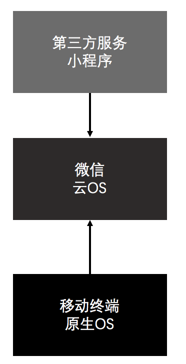
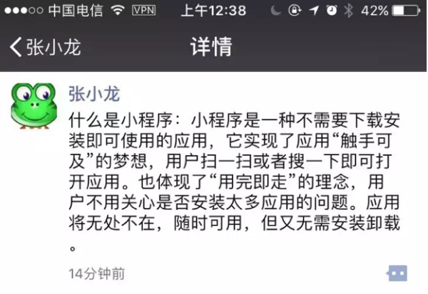
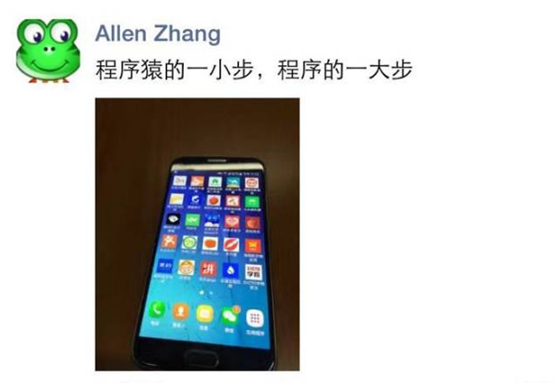

# 一／微信小程序介绍
## 基本介绍
* 不是 Web App（HTML5），也不是 Hybrid App
* 一个有局限的类似 React Native 轮子
* 即用即走，入口跟普通app一样，下载完就留存在手机桌面
* 拥有离线能力
* 一次开发，多端兼容
* 比 Web App、Hybrid App 更好的操作体验

## 基础知识
* JavaScript

微信小程序的 JavaScript 运行环境即不是 Browser 也不是 Node.js。它运行在微信 App 的上下文中，不能操作 Browser context 下的 DOM，也不能通过 Node.js 相关接口访问操作系统 API。所以，严格意义来讲，微信小程序并不是 HTML5，虽然开发过程和用到的部分技术栈和 HTML5 是相通的。 

* WXML（标签语言）

作为微信小程序的展示层，并不是使用 HTML，而是自己发明的基于 XML 语法的描述。

* WXSS（样式语言）

用来修饰展示层的样式。官方的描述是 “ WXSS (WeiXin Style Sheets) 是一套样式语言，用于描述 WXML 的组件样式。WXSS 用来决定 WXML 的组件应该怎么显示。” “我们的 WXSS 具有 CSS 大部分特性...我们对 CSS 进行了扩充以及修改。”基于 CSS2 还是 CSS3？大部分是哪些部分？是否支持 CSS3 里的动画？不得而知。

## 内核与运行机制
* iOS

在 iOS 上，小程序的 JavaScript 代码是运行在 JavaScriptCore 中。JavaScriptCore 是开源的，OS X Mavericks 和 iOS 7 引入了 JavaScriptCore 库，它把 WebKit 的 JavaScript 引擎用 Objective-C 封装，提供了简单，安全的方式接入 JavaScript。

* Android

在 Android 上，小程序的 JavaScript 代码是通过 X5 内核来解析。唯一一个属于国人开发，大鹅厂自己的浏览器解析内核。

* DevTool

在 桌面端开发工具 上，小程序的 JavaScript 代码是运行在 NW.js 中。NW.js 是基于 Node.js 和 Webkit 运行的，这就给了你使用HTML和JavaScript来制作桌面应用的可能。在应用里你可以直接调用Node.js的各种api以及现有的第三方包。

## ES6 支持
微信小程序运行在三端：iOS、Android 和 用于调试的桌面端开发工具，虽然尽管三端的环境是十分相似的，但是至少在目前还是有一些区别的，这给很多开发者带来很大的困扰。

在 0.10 以及之后版本的开发工具中，会默认使用 babel 将开发者代码 ES6 语法转换为三端都能很好支持的 ES5 的代码，帮助开发者解决环境不同所带来的开发问题。

这种转换只会帮助开发处理语法上问题，新的 ES6 的 API 例如 Promise 等需要开发者自行引入 Polyfill 或者别的类库。

## 当前进度
* 2016年9月 小程序内测

* 2016年11月 开放公测

* 预计最迟明年初正式版上线