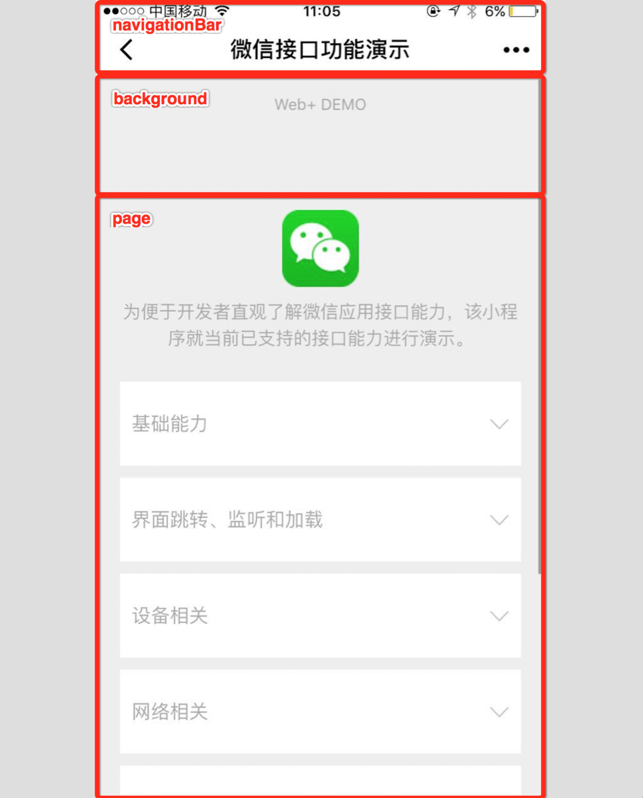
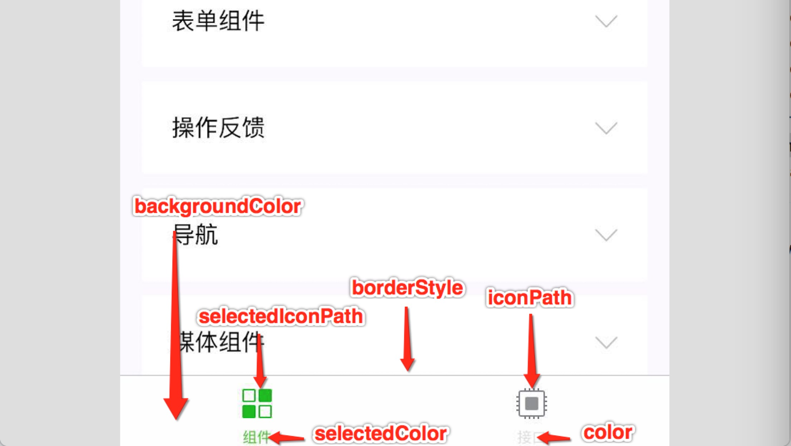

# 二 / 微信小程序框架
## 主体结构
一个小程序主体部分由三个文件组成，必须放在项目的根目录

* 小程序主体
	* app.js
	* app.json
	* app.wxss

### app.js

* 注册小程序主体 
* 主体的生命周期函数
* 初始化全局数据与函数

```javascript
App({
  onLaunch: function() { 
    // 当小程序初始化完成时，会触发 onLaunch（全局只触发一次）
  },
  onShow: function() {
    // 当小程序启动，或从后台进入前台显示，会触发 onShow
  },
  onHide: function() {
    // 当小程序从前台进入后台，会触发 onHide
  },
  globalData: 'I am global data'
})
```

### app.json
	
* page：设置页面路径

小程序中新增/减少页面，都需要对 pages 数组进行修改。

文件名不需要写文件后缀，因为框架会自动去寻找路径.json,.js,.wxml,.wxss的四个文件进行整合。

```json
{
  "pages": [
    "pages/index/index"
    "pages/logs/logs"
  ]
}
```

* window：设置默认页面的窗口表现

    * 导航栏背景颜色
    * 导航栏标题颜色
    * 导航栏标题文字内容
    * 窗口的背景色
    * 下拉背景字体、loading 图的样式
    * 是否开启下拉刷新



* tabBar：设置底部 tab 的表现
    * tab 上的文字默认颜色
    * tab 上的文字选中时的颜色
    * tab 的背景色
    * tabbar上边框的颜色
    * tabbar的位置：可选值 bottom、top



* networkTimeout：设置网络超时时间
* debug：设置是否开启 debug 模式

### app.wxss

* 全局样式表