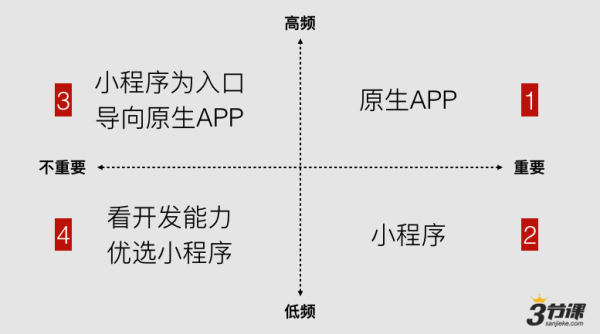
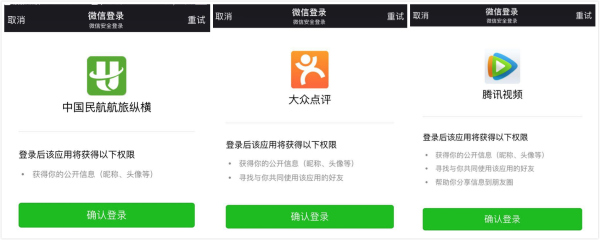

# 四／微信小程序规范

## 设计指南
### 熟悉并遵守官方设计指南
* [官方设计指南](https://mp.weixin.qq.com/debug/wxadoc/design/index.html)

### 一个应用同时只能打开5个页面
一个应用同时只能打开5个页面，当已经打开了5个页面之后，`wx.navigateTo` 不能正常打开新页面。请避免多层级的交互方式，或者使用`wx.redirectTo`

### tab栏有什么限制
tabBar 是一个数组，只能配置最少2个、最多5个 tab，tab 按数组的顺序排序。

### 使用控件库设计资源
* [控件库设计资源](https://mp.weixin.qq.com/debug/wxadoc/design/?t=20161109#资源下载)

## 运营规范 
### 特点和限制
* 无关注功能

和服务号、订阅号不一样，小程序是没有关注功能的。

* 不是 Web App（HTML5），也不是 Hybrid App

我们经常在朋友圈看到的非常炫酷还带背景音乐的 H5 页面，将不会在小程序里出现。

它不兼容 HTML，网页代码在小程序里无法使用

* 没有外链

不兼容 HTML 还意味着，你无法在小程序里放置外链。HTML 里的 `<a>` 标记是被禁止的。

这很大程度上限制了营销。服务号里，我们好歹还能在文章里插入链接，而目前版本的小程序，是不能插入外链的，哪怕是放置二维码，直接在页面上长按，也没有「识别二维码」选项（当前版本）。

* 用微信自己的样式语言开发的类原生程序

微信小程序不是用 HTML 开发的，也不兼容 HTML 标签，微信小程序的体验是与原生 app 接近的，因为除了数据以外，定义页面的样式、数据结构、逻辑等文件已经提前下载，不像网页那样需要实时加载。

而且，因为页面可以调用小程序提供的组件，这些组件早已内置在微信客户端，它们的体验其实就是「原生」的。

* 无法分享到朋友圈

无法分享到朋友圈，这意味着你不会在朋友圈看到小程序刷屏，刷屏的，还是原来那些东西。

从经验上来看，微信会尽一切努力维护朋友圈秩序。以后小程序能不能分享到朋友圈我不知道，但至少一开始不打开这个口对微信来说是好事，一旦打开，就很难收回来了。

* 前端开发成本低

前端开发其中一个最大的成本是兼容性适配，不管是做网页的前端需要适配各种浏览器，还是做 iOS、Android 客户端开发，需要在各种尺寸、性能不同的设备中反复调试。

开发微信小程序，对于前端工程师来说，成本是相对较低的，因为微信已经解决了兼容性问题，前端工程师只需要按照规范去开发，兼容性问题交给微信。

一次开发，多平台通用。

* 离线使用与 Websocket 的想象力

微信小程序支持离线使用，也支持后台运行，这为小工具带来想象力。

* 没有游戏，没有直播

目前版本小程序文档里明确写明，游戏类、直播类、小程序导航，小程序链接互推，小程序排行榜等都不能提交。

* 有审核机制

和订阅号、服务号不一样，你发文章不需要通过微信审核，你改按钮功能也不需要，但小程序的每个版本更新，都必须通过微信审核 — 就像 App Store 那样。

* 其它限制

    * 邮箱无法与公众号、开放平台、绑定个人微信号的邮箱重复
    * 小程序名称不能与公众号名称重复
    * 是否需要认证？不认证也可以上传小程序；但是需要使用微信支付接口的话则必须认证。
    * 申请支付需新建商户号
    * [微信小程序平台运营规范](https://mp.weixin.qq.com/debug/wxadoc/product/index.html?t=20161122)

### 适用场景
* 哪些服务和企业最适合接入小程序？

应该说，不是所有的服务都适用小程序，但大部分的服务和几乎所有的初创业务都是可以接入小程序的。

哪些服务是可以接入，哪些又是不可以接入的呢？先看一个模型。按照重要/不重要，高频/低频，我们将互联网产品分别放入四个象限。

小程序适合服务类产品，例如教育、医疗、家政、旅游、票务、金融理财等等，但凡用户日常使用频率不是很高的产品，是不应该用一个原生引用的方式让用户下载，而应该是通过微信小程序来解决。

* 基于微信小程序开发，也得拼爹

微信上的关系链，是有条件的开放。

上图可以看到，这基本上算是三个开放的逻辑了。

只开放公开信息：昵称、头像，其实也就是登陆ID，所有的开发者都可以接入，比如航旅纵横。

有条件开放：开放共同使用的好友。比如大众点评。所以基于大众点评，你可以看到好友的相关信息。

更大程度的开放：除了登陆和好友关系，还开放了朋友圈权限，能把一些操作直接输送到朋友圈做动作，比如，QQ音乐、腾讯视频等。
